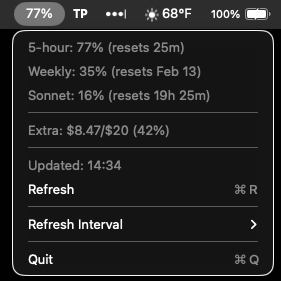

# Claude Usage Tracker

A macOS menu bar app that displays your Claude usage limits and reset times. Shows your 5-hour session usage, weekly limits, and extra usage spending in real-time.


## Features

- **Live usage percentage** in menu bar (5-hour session)
- **5-hour session** usage with reset countdown
- **Weekly limits** with reset date
- **Sonnet-specific** weekly limit tracking
- **Extra usage** spending ($X/$Y format)
- **Auto-refresh** every 60 seconds
- **Secure** - uses Claude Code's existing OAuth credentials from macOS Keychain

## Screenshot



## Requirements

- macOS
- Python 3.9+
- [Claude Code](https://claude.ai/code) installed and logged in
- Claude Pro or Max subscription

## Installation

### Quick Install

```bash
cd ~/claude-usage-tracker
./install.sh
```

### Manual Install

```bash
# Clone the repo
git clone https://github.com/cfranci/claude-usage-tracker.git
cd claude-usage-tracker

# Create virtual environment
python3 -m venv venv
source venv/bin/activate

# Install dependencies
pip install -r requirements.txt

# Run
python tracker.py
```

## Usage

1. **First**, make sure you're logged into Claude Code (`claude` command works)
2. Run the tracker:
   ```bash
   cd ~/claude-usage-tracker
   ./venv/bin/python tracker.py
   ```
3. Look for the percentage in your menu bar
4. Click to see detailed usage breakdown

### Auto-start at Login

The install script can set up auto-start, or manually create a Launch Agent:

```bash
mkdir -p ~/Library/LaunchAgents

cat > ~/Library/LaunchAgents/com.claude-usage-tracker.plist << EOF
<?xml version="1.0" encoding="UTF-8"?>
<!DOCTYPE plist PUBLIC "-//Apple//DTD PLIST 1.0//EN" "http://www.apple.com/DTDs/PropertyList-1.0.dtd">
<plist version="1.0">
<dict>
    <key>Label</key>
    <string>com.claude-usage-tracker</string>
    <key>ProgramArguments</key>
    <array>
        <string>$HOME/claude-usage-tracker/venv/bin/python</string>
        <string>$HOME/claude-usage-tracker/tracker.py</string>
    </array>
    <key>RunAtLoad</key>
    <true/>
</dict>
</plist>
EOF
```

## How It Works

The app reads your Claude Code OAuth credentials from macOS Keychain (`Claude Code-credentials`) and queries the Anthropic usage API endpoint to get your current limits:

- `five_hour` - Rolling 5-hour usage window
- `seven_day` - Weekly usage cap
- `seven_day_sonnet` - Sonnet-specific weekly limit
- `extra_usage` - Overage spending if enabled

The usage API is free to call and doesn't consume any tokens.

## Files

| File | Description |
|------|-------------|
| `tracker.py` | Main menu bar app |
| `anthropic_api.py` | API client for OAuth usage endpoint |
| `config.py` | Keychain and config management |
| `requirements.txt` | Python dependencies |
| `install.sh` | Installation script |

## Troubleshooting

### "?" in menu bar or usage shows 0%
- Make sure Claude Code is installed and logged in
- Run `claude` in terminal to verify it works
- **For Pro/Max users**: Your OAuth token may have expired. Follow these steps:
  1. Open terminal and run: `claude setup-token`
  2. This opens a browser to re-authenticate with your Claude subscription
  3. After authenticating, restart the tracker
- **API key users**: This app requires a Pro or Max subscription. API credits cannot be used to track subscription usage limits.

### Getting "OAuth token has expired" error
The OAuth token in your Keychain has expired. To fix:
1. Delete old credentials: `security delete-generic-password -s "Claude Code-credentials"`
2. Run `claude setup-token` to get a fresh token
3. Restart the tracker

### Requirements
- **Claude Pro or Max subscription** (not API credits)
- **Valid billing** on your Anthropic account
- OAuth tokens come from your subscription, not API keys

### App doesn't start
- Check Python version: `python3 --version` (needs 3.9+)
- Reinstall dependencies: `pip install -r requirements.txt`

### Usage shows 0%
- Your session may have just reset
- Try clicking "Refresh"

## License

MIT

## Credits

Built for tracking [Claude](https://claude.ai) usage limits on macOS.

Uses [rumps](https://github.com/jaredks/rumps) for menu bar integration.
